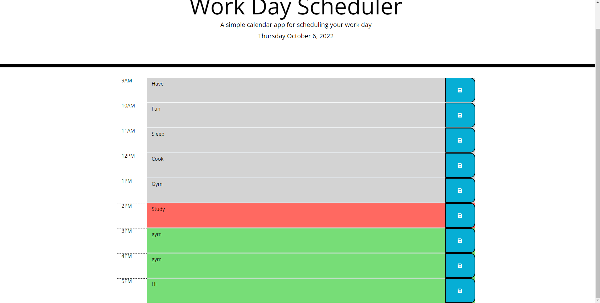

# Work-Day-Scheduler

## Description 
This is an basic daily planner. Depending on the time of the day the time-slots in the planner would display different colors. Red for current, gray for past , and green for future. Information is also stored in the local storage so on refresh your plans will still be saved. 

## User Story
AS AN employee with a busy schedule

I WANT to add important events to a daily planner

SO THAT I can manage my time effectively

## Acceptance Citeria
GIVEN I am using a daily planner to create a schedule
WHEN I open the planner
THEN the current day is displayed at the top of the calendar
WHEN I scroll down
THEN I am presented with time blocks for standard business hours
WHEN I view the time blocks for that day
THEN each time block is color-coded to indicate whether it is in the past, present, or future
WHEN I click into a time block
THEN I can enter an event
WHEN I click the save button for that time block
THEN the text for that event is saved in local storage
WHEN I refresh the page
THEN the saved events persist

## ScreenShot
  

## URL
